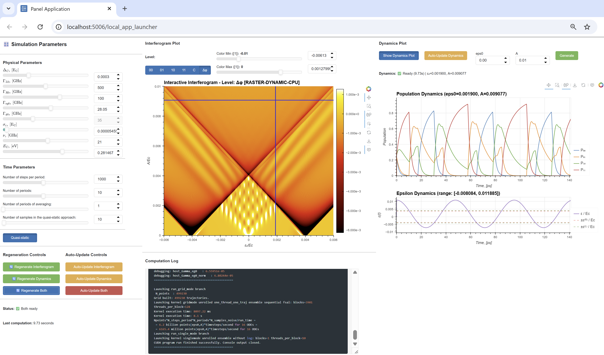
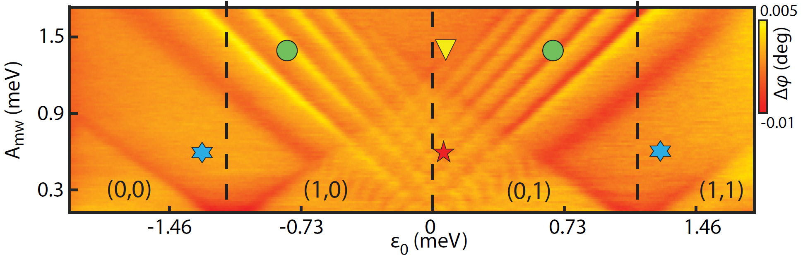

# Double quantum dot Landau-Zener-Stückelberg-Majorana (LZSM) interferogram and dynamics simulator

[](LICENSE)

This project provides a high-performance interactive tool for simulating and visualizing quantum dynamics, and Landau-Zener-Stukelberg-Majorana (LZSM) interferograms of the open quantum system of double quantum dot. It leverages CUDA for GPU-accelerated solutions of the Lindblad master equation and a Python-based interactive dashboard for real-time parameter tuning and visualization.

The simulator solves the Lindblad master equation for the specific double quantum dot system in parallel for a set of parameters of the driving signal on GPU using C/CUDA programming language. The high-level scripting, data handling, and plotting is implemented using Python programming language. The Lindblad equation is solved using custom CUDA kernels with a 4th-order Runge-Kutta (RK4) method. The project is designed for researchers and students in quantum physics, enabling detailed exploration of system dynamics under various physical conditions.

## 🚀 Quick Start. Run in Google Colab

[](https://colab.research.google.com/github/artem-ryzhov-1/cuda_python_project/blob/main/run_in_colab.ipynb)

> Click the badge above → Enable GPU runtime → Run all cells → Interact with the dashboard. No installation required, you are only required to have Google account. Click the badge to launch the interactive simulation environment directly in your browser (using Google Colab). The Google Colab notebook inlcudes the detailed description of all steps for launching the interactive simulation.

## ⚛️ Overview

The Quantum interferogram and dynamics simulator is a research-grade computational tool designed to solve the **Lindblad master equation** for double quantum dot (DQD) system. It simulates dynamics and **Landau-Zener-Stückelberg-Majorana (LZSM) interference patterns** in semiconductor qubits, enabling researchers to:

- Explore quantum dynamics under various physical conditions
- Visualize interferogram patterns (quantum capacitance vs. detuning and amplitude)
- Analyze time-evolution dynamics of quantum states
- Identify operational regimes of quantum devices
- Extract device parameters from experimental data


---

## 🎛️ Interface. Interactive Dashboard



The web-based dashboard provides:

### Real-Time Parameter Control

Adjust physical parameters with sliders:
- **Hamiltonian:** Δ_C (tunnel coupling)
- **Dissipation:** Γ_L, Γ_R (lead coupling), Γ_1 (phonon relaxation), Γ_φ (dephasing)
- **Drive:** nu_d (frequency), A (amplitude), ε₀ (detuning offset)
- **Numerical:** Time steps, periods, noise samples

### Synchronized Views

1. **Interferogram** - Color map of C_Q(ε₀, A) or individual populations of |00⟩, |01⟩, |10⟩, |11⟩ showing regime boundaries
2. **Time Dynamics** - Evolution of state populations P_{N₁,N₂}(t)

### Interactive Features

- **Click-to-select:** Click any point in interferogram → see time dynamics
- **Real-time updates:** All plots update within 2-5 seconds
- **Export options:** Save plots and data files


---

## 🔬 Physical Background

This project accompanies the paper:

> **"Quantum control of multi-level systems: four driving regimes of a double-quantum dot"**  
> A. I. Ryzhov, M. P. Liul, S. N. Shevchenko, M. F. Gonzalez-Zalba, Franco Nori, in preparation.

The simulator implements the theoretical framework described in the paper, allowing researchers to:

- Reproduce all figures from the manuscript
- Explore parameter regimes beyond those studied in the paper
- Extract device parameters from experimental interferograms
- Understand the physics of strongly driven quantum systems

One of the goals of the paper is to reproduce the experimental interferogram of the quantum capacitance



from the paper

> **"A silicon-based single-electron interferometer coupled to a fermionic sea"**  
> A. Chatterjee, et. al., Phys. Rev. B **97**, 045405 (2018).

### The Quantum System

The simulator models a **double quantum dot (DQD)** system with four charge states:

```
|N₁, N₂⟩ = |00⟩, |01⟩, |10⟩, |11⟩
```

Where N₁ and N₂ represent the number of electrons on the left and right dots, respectively.

### Lindblad Master Equation

The density matrix ρ evolves according to the Lindblad master equation:

```
dρ/dt = -i[H, ρ]/ℏ + Σₖ D[Lₖ]ρ
```

Where:
- **H** is the 4×4 diabatic Hamiltonian (capacitive coupling, tunnel coupling, driven detuning)
- **D[Lₖ]** are dissipator terms modeling:
  - Dot-lead coupling (charge transitions with reservoirs)
  - Phonon-induced relaxation (energy relaxation)
  - Quasi-static dephasing (charge noise)

### Observable: Quantum Capacitance

The primary observable is the **quantum capacitance** C_Q(ε₀, A), which displays characteristic interference fringes when plotted against detuning offset (ε₀) and drive amplitude (A).


### Operational Regimes

The simulator helps identify five distinct regimes:
1. **Multi-passage** - Multiple Landau-Zener transitions per period
2. **Double-passage** - Two transitions per period
3. **Single-passage** - One transition per period
4. **Incoherent** - Decoherence-dominated dynamics
5. **No-passage** - Drive amplitude below threshold

---

## ⚙️ Features

- **High-Performance Simulation**: GPU-accelerated CUDA backend for solving the Lindblad master equation using a 4th-order Runge-Kutta (RK4) method with custom kernels. It solves multiple Lindblad master equations (for different parameters of the driving signal) in parallel on GPU, which is around 1000x faster than solving them on CPU.
- **Interactive Dashboard**: Real-time visualization with 500k+ parameter points. A web-based interface built with Python libraries Panel and HoloViews allows for real-time adjustment of physical parameters and immediate visualization of results.
- **Cross-Platform Compatibility**: Fully compatible with Linux, Windows (with CUDA), and Google Colab.
- **Modular CUDA Kernels**: The CUDA code is structured with modular components for commutators and dissipators, separating kernels, host code, and Python orchestration for maintainability and extensibility.
- **Advanced Visualization**: Generate and inspect detailed interferograms and time-evolution dynamics plots.


### Technology Stack

```
┌─────────────────────────────────────────────────────────┐
│                   User Interface                        │
│          Panel + HoloViews + Matplotlib                 │
├─────────────────────────────────────────────────────────┤
│                   Python Layer                          │
│    Configuration │ Simulation │ Visualization │ I/O     │
├─────────────────────────────────────────────────────────┤
│                   C/CUDA Backend                        │
│   Lindblad Solver │ RK4 Integration │ GPU Kernels       │
└─────────────────────────────────────────────────────────┘
```

---


## 📁 Project Structure

```
.
├── app/
│   ├── requirements.txt       # Python dependencies
│   ├── build_scripts/
│   │   ├── build_local_linux.sh    # Local build script (Linux/WSL2)
│   │   ├── build_local_windows.bat # Local build script (Windows)
│   │   └── setup_colab.sh          # Colab-specific setup and build
│   ├── cuda/                  # Core CUDA source code for the simulation kernel
│   │   ├── Makefile           # CUDA build configuration
│   │   ├── bin/               # Compiled executables (generated)
│   │   ├── external/          # External dependencies (nlohmann JSON)
│   │   ├── input/             # Configuration files
│   │   │   └── run_config.json
│   │   ├── output/            # Simulation output data (binary files)
│   │   └── src/
│   │       ├── main.cu        # Entry point for CUDA kernels
│   │       ├── constants.cuh  # Shared constants for device/host
│   │       ├── commutator/    # Commutator computation kernels
│   │       ├── dissipators/   # Dissipator kernels for various physical processes
│   │       ├── host/          # Host-side logic and helpers
│   │       │   ├── host_branch_grid.cuh   # Grid branching logic
│   │       │   ├── host_branch_single.cuh # Single branching logic
│   │       │   ├── host_helpers.cuh       # Utility functions
│   │       │   └── log_writer.cuh         # Logging utilities
│   │       ├── kernels/       # Core Lindblad evolution kernels
│   │       └── rk4/           # Runge-Kutta 4th order integration
│   ├── python/                # Python classes for simulation logic and visualization
│   │   ├── app_class_dynamics_plot.py
│   │   ├── app_class_interactive_interferogram_dynamics.py
│   │   ├── app_class_interferogram_plot.py
│   │   ├── app_class_simulation_parameters.py
│   │   ├── config.py          # Configuration utilities
│   │   ├── cuda_runner.py     # CUDA execution wrapper
│   │   ├── file_io.py         # Binary file I/O
│   │   ├── helpers.py         # Platform detection & utilities
│   │   ├── simulation.py      # Simulation orchestration
│   │   └── deprecated/        # Legacy code versions
│   └── launcher/              # Entry points for launching the application
│       └── local_app_launcher.py
├── codegen/                   # Scripts to auto-generate CUDA code for complex models
│   ├── generate_commutator_code.py
│   ├── generate_dot_lead_dissipators_codes.py
│   └── generate_eg_phi_dissipators_codes.py
├── docs/                      # Detailed documentation
│   ├── images/                # image files used in documentation
│   ├── ARCHITECTURE.md        # System design and technical decisions
│   ├── CODE_OVERVIEW.md       # Source code structure breakdown
│   └── API.md                 # Simulation parameters and configuration guide
├── plots/                     # Scripts for generating specific plots
│   ├── single_dynamics.py
│   ├── single_interferogram.py
│   └── single_interferogram_and_dynamics.py
├── tests/                     # Tests for verifying simulation output
│   ├── check_log_data.py
│   ├── check_nan_in_outpud_data.py
│   ├── cuda_program_runner_json.py
│   └── log_reader.py
├── sandbox/                   # Programs in development; experiments.
├── run_in_colab.ipynb         # Google Colab notebook for easy cloud execution
├── README.md                  # This file
├── LICENSE                    # Project license (MIT)
└── .gitignore                 # Git ignore rules
```


## 🧰 Prerequisites

### Local Setup (Linux/WSL2/Windows)

- **NVIDIA GPU**: A CUDA-enabled GPU is required.
- **CUDA Toolkit**: Version 11.0 or later. Ensure `nvcc` is in your system's PATH and verify with `nvcc --version`.
- **Python**: Version 3.8 or higher.

### Google Colab

- A Google account with access to a GPU runtime (T4 or better recommended for performance).

## 🚀 How to Run

### 1. Google Colab (no installation required, recommended for first-time users)

The easiest way to get started is by using the provided Google Colab notebook. Simply click the "Open in Colab" badge at the top of this README. The notebook contains all the necessary steps to set up the environment, compile the code, and launch the interactive dashboard.

**Steps:**

1. Open the Colab notebook and enable GPU runtime: `Runtime > Change runtime type > Hardware accelerator > GPU`.

2. The notebook will automatically:
   - Clone the repository
   - Install Python dependencies
   - Compile the CUDA program using the Colab setup script
   - Launch the interactive dashboard

3. Expected output: An interactive simulation environment with real-time visualization.

### 2. Local Environment (Linux/WSL2/Windows)

**Step 1: Clone the Repository**

```bash
git clone https://github.com/artem-ryzhov-1/cuda_python_project.git
cd cuda_python_project
```

**Step 2: Install Python Dependencies**

```bash
pip install -r app/requirements.txt
```

**Step 3: Compile the CUDA Program**

The build scripts automatically detect your platform and GPU architecture.

- **On Windows:**
  ```cmd
  .\app\build_scripts\build_local_windows.bat
  ```

- **On Linux or WSL2:**
  ```bash
  chmod +x app/build_scripts/build_local_linux.sh
  ./app/build_scripts/build_local_linux.sh
  ```

This will compile the CUDA source and create an executable at `app/cuda/bin/lindblad_gpu`.

**Step 4: Launch the Interactive Dashboard**

Use `panel serve` to run the application launcher:

```bash
panel serve app/launcher/local_app_launcher.py --show
```

This will open the interactive dashboard in your default web browser.


## 📚 Documentation

For a deeper understanding of the project, please refer to the detailed documentation:

- **[Architecture](./docs/ARCHITECTURE.md)**: An overview of the system design, data flows, and key technical decisions.
- **[Code Overview](./docs/CODE_OVERVIEW.md)**: A detailed breakdown of the source code structure.
- **[API Reference](./docs/API.md)**: A guide to the simulation parameters and configurable options available in the dashboard.

## 📜 License

See the [LICENSE](LICENSE) file for details.

## 📧 Contact & Support

- **Issues:** [GitHub Issues](https://github.com/artem-ryzhov-1/cuda_python_project/issues)
- **Email:** [artem.ryzhov.14@gmail.com]
- **Paper:** [arXiv:XXXX.XXXXX](https://arxiv.org/abs/XXXX.XXXXX)